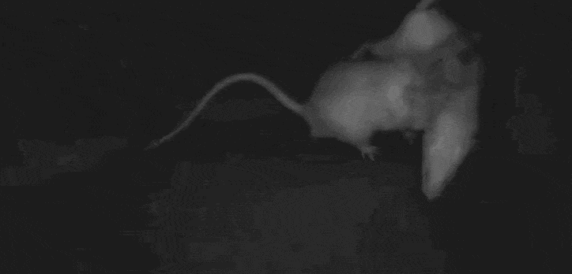

# Neural Data Science (970405) Final Project

**Students:** Daniel Katz, Rona Lavi, Sophia Danilov

**Technion, Spring 2026**

---

## Repository contents

| Path | Description |
|------|-------------|
| [`project_report.md`](project_report.md) | Final project report |
| [`appendix.md`](appendix.md) | Full per-session results, pooled summaries, and robustness checks referenced from the report |
| [`code.ipynb`](code.ipynb) | Project's code |
| `figures/` | All figures used in the report and appendix |
| `Data/` | Placeholder, not included because this is a public repository |

## Interactive GUIs

For your convenience, we also include two Streamlit-based GUI applications we developed and used throughout this project:

| Folder | Description |
|--------|-------------|
| [`Exploration GUI/`](Exploration%20GUI) | General-purpose data exploration tool for browsing sessions, raster plots, trajectories, and neural activity |
| [`Social Decay  GUI/`](Social%20Decay%20%20GUI) | Focused tool for the social-residue analysis: classifier results, diffusion-map embeddings, and decay curves across sessions |
