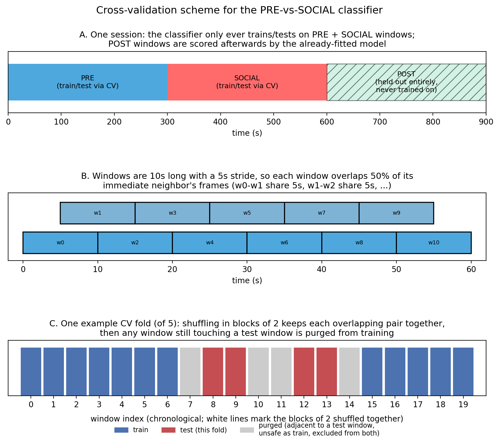
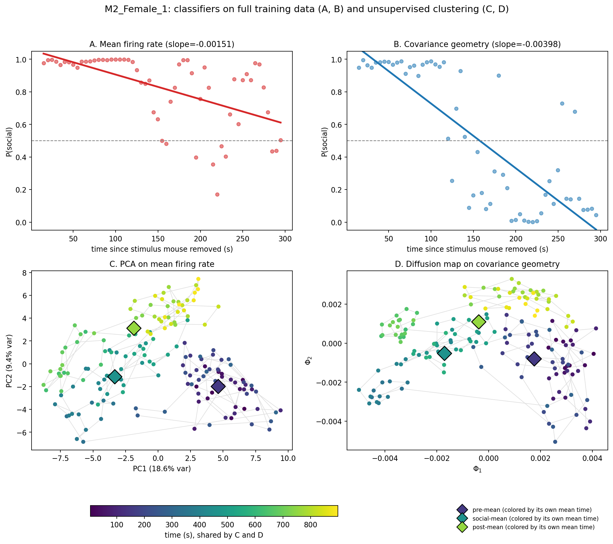
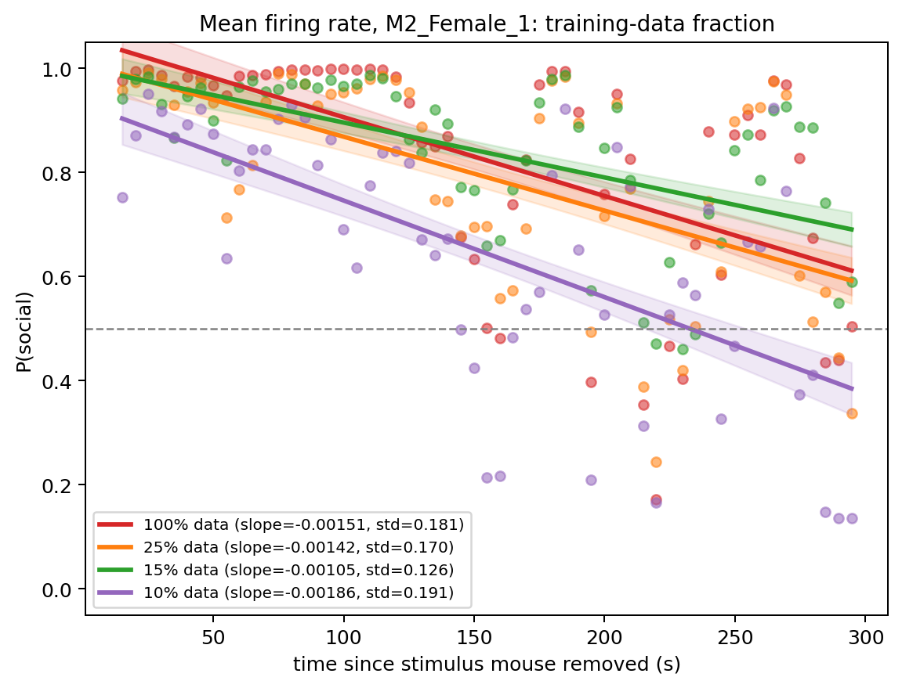
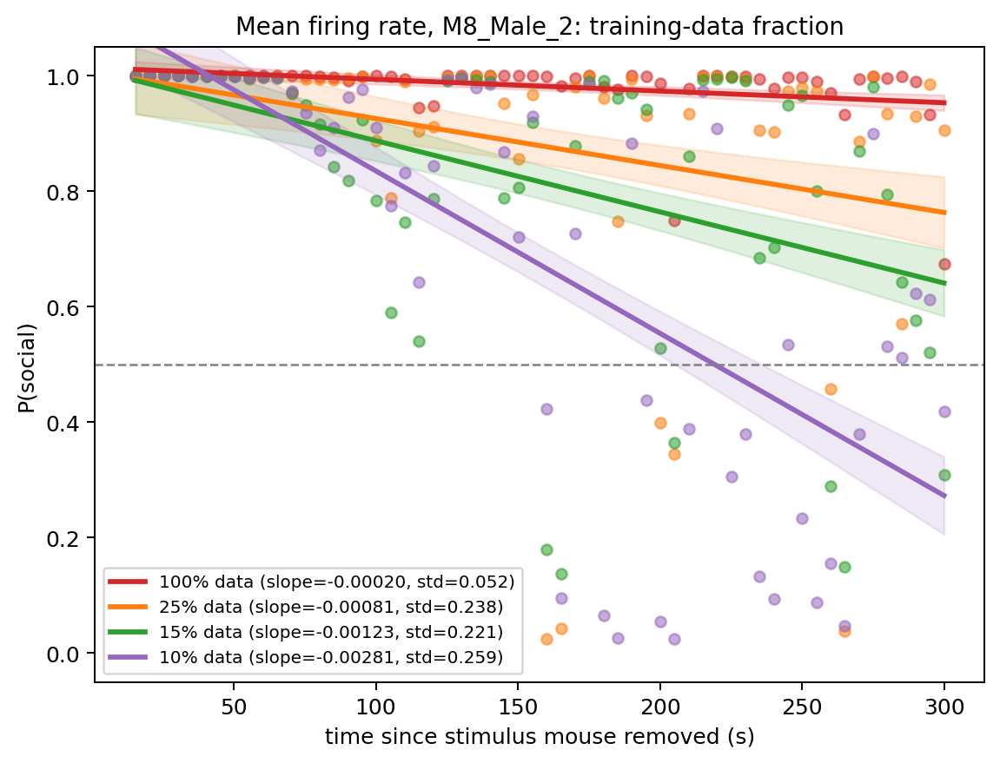
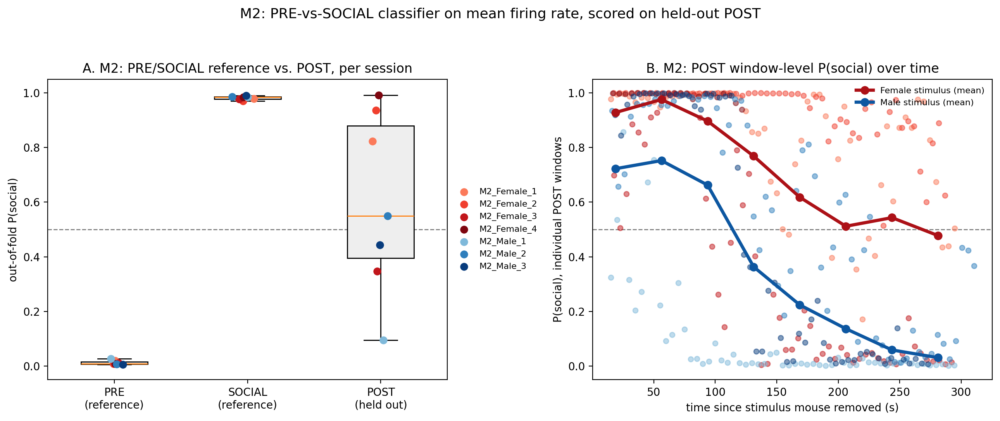

# Neural Data Science 970405: Final Project Report

**Students:** Daniel Katz, Rona Lavi, Sophia Danilov

**Project question:** After a social encounter ends, does the mouse's mPFC keep a trace of it? Concretely: if we train a classifier to tell "alone" (PRE) apart from "with another mouse" (SOCIAL), and then show it activity from after the encounter (POST, when the mouse is alone again), does it still see something social?

**Bonus question:** If that residue exists, does it depend on the sex of the stimulus mouse?

*Full per-session results, pooled summaries, and robustness checks not shown here are in [appendix.md](appendix.md).*

---

## 1. Introduction

The medial prefrontal cortex (mPFC) is known to play a central role in social behavior in mice, and damage to it produces social deficits reminiscent of autism spectrum disorder (Levy et al., 2019). Work from the Wagner Lab at the University of Haifa, who collected the dataset we use here, has shown that individual mPFC neurons respond to the presence, identity, and location of another mouse (Netser et al., 2017). But that is a single-cell story. Whether the *population* as a whole carries a coherent signal about social context, and whether that signal survives after the other mouse is gone, is less clear.

That is what we look at here. Each recording follows a PRE / SOCIAL / POST design: the focal mouse is alone, then a stimulus mouse is introduced, then it is removed and the focal mouse is alone again. We train a classifier to tell PRE from SOCIAL population activity, and then, without retraining it, we hand it POST windows and ask what it sees. POST looks just like PRE from the outside, the mouse is alone in both, so if the classifier still leans toward "social" right after the stimulus mouse leaves, that is not something we can explain away by movement or arousal differences between being alone and not. It would mean some trace of the encounter is still sitting in the population activity, though it could also be the stimulus mouse's scent lingering in the cage rather than a true memory trace. We refer to this as the fading, or residue, of the social state.

This connects to a broader question: does the brain only represent the present moment, or does it hold onto a short-term trace of a recent social event? If a residue like this exists, it suggests the mPFC does not just report "social or not" in real time, it keeps something around after the interaction ends.

We build up to this in four steps: (1) describe the dataset and how we define PRE/SOCIAL/POST, (2) train a PRE-vs-SOCIAL classifier on mean firing rate and score it on held-out POST windows, (3) look at the same question from an unsupervised angle, using diffusion-map clustering on population covariance structure, and (4) repeat the classifier from step 2, but on covariance-geometry features instead of mean rate, to see whether the two representations tell the same story.

**Goal:** detect this social residue in the POST phase, using a classifier trained only on PRE and SOCIAL, and characterize how it plays out across mice, sessions, and stimulus sex.

## 2. Methods

### Dataset

We use 33 recording sessions from the mPFC of 5 mice (M2, M3, M6, M7, M8), each exposed to either a female or a male stimulus mouse (4,263 cells total, 40-250 cells per session). Every session follows the same structure: the focal mouse is alone for approximately 300 s (PRE), a stimulus mouse is introduced for approximately 300 s (SOCIAL), then removed and the focal mouse is alone again for approximately 300 s (POST). Phase boundaries are taken from the DLC video tracking rather than the nominal clock times, and a 10 s guard band is excluded on each side of every transition to avoid training on ambiguous, transitional frames.

Within each session, we slide a 10 s window across the recording with a 5 s stride, so consecutive windows overlap by half. Every method below operates on these same windows, and every session is fit and evaluated entirely on its own data; windows are never pooled across sessions or mice, since cell count and baseline activity differ session to session, and pooling would let a model separate sessions rather than phases.

For the two classifiers below, a chronological train/test split is not viable: PRE always precedes SOCIAL entirely, so it would place almost all of one phase in training and the other in testing. We instead use 5-fold shuffled block cross-validation: windows are grouped into blocks of 2 consecutive, overlapping windows so a block is never split across train and test, the blocks are shuffled and divided into 5 folds, and any window still adjacent to a test window is additionally purged from training. No training window shares a frame with a test window.

Once trained, a classifier is applied to POST windows, which it never saw during training or cross-validation, and each is scored by the model's predicted probability of the SOCIAL class, P(social). A score near 1 still resembles SOCIAL activity; a score near 0 resembles baseline. We track P(social) as a function of time since the stimulus mouse was removed, to test whether any residue decays back toward PRE.

### PRE-vs-SOCIAL classifier on mean firing activity, scored on held-out POST

The feature vector is each cell's mean firing rate within a window, using every recorded cell in the session. We train an L2-regularized logistic regression (C=1.0, standardized features) to separate PRE from SOCIAL windows, using the cross-validation scheme above.

### Clustering methods: PCA and diffusion maps

We complement the supervised classifiers with two unsupervised views of the same data, to see whether PRE/SOCIAL/POST structure emerges without ever providing phase labels. As a linear, first-order baseline, we run PCA on the z-scored mean-rate features and retain the first two components. As a second-order alternative, we build a correlation matrix over every recorded cell for each window (silent channels are handled without dropping the window, and a small ridge term keeps every matrix full-rank), compute the pairwise affine-invariant Riemannian (geodesic) distance between windows, and embed them with a diffusion map, following the approach of Ghanayim, Benisty et al. (2024): a Gaussian kernel of this distance is row-normalized into a transition matrix, and its two largest non-trivial eigenvectors give the embedding coordinates. Each phase's Riemannian mean is embedded jointly as a landmark, this is the diamond marker shown for each phase in figures below: for the diffusion map it is the Riemannian mean of that phase's correlation matrices, and for PCA it is simply the average PC1/PC2 position of that phase's points. Points are colored by phase after the fact, purely to check whether the unsupervised structure agrees with the classifiers, not to guide the embedding itself.

### Same classifier, on covariance-geometry features

We repeat the PRE-vs-SOCIAL, scored-on-POST design above with the same model and cross-validation scheme, but replace the feature vector: instead of mean firing rate, each window is represented by a tangent-space vector of its own correlation matrix, computed relative to a reference fit only on that fold's training data (so it never sees test or POST windows). Everything else is held constant, so any difference from the mean-rate result reflects the feature representation alone.

### Regularization concerns

Our worry was overfitting to features that separate PRE from SOCIAL but have nothing to do with social state itself, within-session temporal drift, differences in movement or arousal between being alone and not, or window-to-window redundancy from the overlapping sliding windows. A classifier that latches onto one of these would still score well on PRE-vs-SOCIAL, but its behavior on POST, a phase it never trained on, would then reflect how it handles unfamiliar input rather than anything about a social residue.

We checked this two ways: stronger L2 regularization (lower C), and training on a smaller random fraction of the PRE/SOCIAL windows. Both preserved the POST decay direction overall, but not identically across sessions, each approach turned out to help reveal a cleaner slope in different sessions rather than one method dominating everywhere; results in [the appendix](appendix.md#5-regularization-does-the-classifier-just-look-unsure-at-05).

## 3. Results

Held-out PRE-vs-SOCIAL accuracy was near-perfect and consistent across sessions (mean-rate features: median 1.00, mean 0.99, worst session 0.87; covariance-geometry features: median 0.96, mean 0.95, worst session 0.72). Given how high that is, we checked it against a label-shuffled null using the identical pipeline (20 shuffles per session, same features and folds): shuffled accuracy sat at chance (median 0.49, 95th percentile 0.58, max 0.71 across all 660 shuffles), so this is not a cross-validation artifact.

The POST result is where sessions stop agreeing with each other. What we actually care about is not whether average P(social) across a session sits above or below 0.5, a flat 0.5 line is just as uninformative as a flat 1.0 line, but whether P(social) has a slope: does it start high and decay back toward baseline as time since the stimulus mouse was removed increases? By that measure, P(social) declines with time in 27 of 33 sessions for mean rate and 24 of 33 for covariance geometry (per-session breakdown in [the appendix](appendix.md#2-all-33-sessions-in-one-plot-per-classifier)). But the shape and steepness of that decay varies a lot from session to session, some show a clean, strong slope, others a faint one, and a few show none. A pooled curve averaged over all 33 sessions blurs that variability into something that looks tidier than it is. So rather than lead with a pooled average, we walk through one session, M2_Female_1, which is worth discussing in its own right: it shows a clean version of the same decay pattern found across much of the dataset, so it is a useful case to look at closely; the same figures for all 33 sessions are also in [the appendix](appendix.md#4-per-mouse-per-session-classifiers-and-clustering-side-by-side).

### Walking through M2_Female_1

Panels A and B show the mean-rate and covariance-geometry classifiers respectively, each trained only on this session's own PRE and SOCIAL windows and scored on its held-out POST windows. Both show the same qualitative pattern, POST windows start out scored almost as SOCIAL-like as the SOCIAL windows themselves, and pull down toward PRE-like values over the course of the 300 s window, but the covariance-geometry classifier (B) shows something the mean-rate classifier (A) does not: a steeper slope that crosses the 0.5 chance line around the midpoint of POST, well before mean rate's crossing late in the window. The correlation structure between neurons is apparently a more sensitive readout of the fading residue than the overall rate elevation is. Panels C and D show the same session viewed with unsupervised methods, PCA on mean-rate features (C) and the diffusion-map embedding on covariance geometry (D), phase labels are used only to color the points after fitting, never during it. Both separate PRE, SOCIAL, and POST into distinct regions on their own, so the residue is not an artifact of the classifiers' decision boundary. Colored by elapsed time, both embeddings also show a visible internal drift: within POST, later points sit closer to the PRE cluster than earlier ones do, and within PRE, the points closest in time to the SOCIAL transition sit closest to the SOCIAL cluster. The state is not just "PRE, SOCIAL, or POST," it is a continuous trajectory that happens to pass through those three regions (Fig. 2).

### What regularization does

M2_Female_1's slope goes from -0.00151 at full data to -0.00105 at 25%, back up to -0.00186 at 10%, its steepest value at any fraction (Fig. 3a). M8_Male_2 moves more directly, from -0.00020 at full data to -0.00281 at 10% (Fig. 3b). So both sessions do get a steeper slope at 10% data, but for M2_Female_1 the spread around the trend line also widens noticeably at 10% (visible as the wider shaded band), and the 25% point sits weaker than full data rather than on a smooth path toward the 10% value, so the improvement does not arrive cleanly. Lowering C behaved differently again: it mainly shifted the whole curve, PRE and SOCIAL references included, toward 0.5, rather than changing the POST slope specifically. More sessions and the covariance-geometry version are in [the appendix](appendix.md#5-regularization-does-the-classifier-just-look-unsure-at-05).

### Bonus: does stimulus sex matter?

This is a mouse-level question more than a group-level one: pooled across all 33 sessions the male-vs-female difference is small relative to the spread between sessions, so we look at mouse M2 specifically instead (per-mouse breakdown in [the appendix](appendix.md#3-per-mouse-male-stimulus-vs-female-stimulus-sessions)). There (Fig. 4), POST P(social) after a female stimulus stays above 0.9 through the first 100 s and only comes down to about 0.47 by 300 s, while after a male stimulus it drops much further, to about 0.03-0.05 by 250-280 s, and that difference in endpoint matters: settling near 0.5 is not the same as returning to PRE, we argued earlier that it more likely reflects the classifier seeing something unfamiliar, while decaying toward 0, as in the male-stimulus sessions, is the stronger evidence for an actual return to baseline. By that reading, M2's response looks closer to a full return to baseline after a male stimulus, and settles into something in between after a female one, though this is one mouse and would need checking against more.

## 4. Discussion

### Variability across sessions, and open questions

POST decay is not uniform. 27 of 33 mean-rate sessions and 24 of 33 covariance sessions show a negative slope, but many of those converge only to around 0.5 rather than continuing down toward 0, decay is not the same as a full return to PRE (see the Bonus section: M2's male-stimulus sessions decay toward 0, its female-stimulus sessions plateau near 0.5). We suspect some of the flatter sessions would show a fuller decay under session-specific regularization, but we only checked two sessions this way (M2_Female_1, M8_Male_2) rather than all 33 individually. Regularization also helped the mean-rate classifier more consistently than the covariance-geometry one; we don't have a confirmed reason why.

Why some sessions show a clear decay and others don't is an open question. We considered three candidate explanations. First, within-session representational drift could be masking a real decay or manufacturing a spurious one; we tested this directly by training a regressor to predict elapsed session time from firing rate, using its accuracy as a proxy for drift strength, and found no correlation between drift strength and whether a session showed a clear decay ([appendix](appendix.md#6-searching-for-confounders-does-drift-explain-the-pattern)). Second, in the unsupervised embeddings POST sometimes forms its own cluster roughly equidistant from both PRE and SOCIAL rather than sitting between them, a classifier forced to score such a point can only land near 0.5, which looks identical to "no residue" even though it reflects a third state the model was never built to represent. Third, a session's own internal variance could act as a kind of built-in regularizer, a noisier session might already behave like a regularized fit, leaving a cleaner session more room to overfit. We only tested the first of these three.

The two representations are not redundant. The covariance-geometry classifier shows a decay in 3 sessions where mean rate is flat or increasing (M3_Female_4, M7_Male_3, M8_Female_2), but loses the decay in 6 sessions where mean rate shows one clearly (M3_Female_3, M3_Male_3, M6_Male_1, M7_Female_1, M7_Female_4, M8_Female_1). Second-order structure occasionally reveals residue that first-order rate misses, but the reverse happens more often. Neither representation alone gives the full picture.

### Supervised classifiers vs. unsupervised embedding

The diffusion-map embedding provides an unsupervised view that complements the supervised classifiers. In sessions like M7_Female_1, POST windows land between the PRE and SOCIAL clusters in the diffusion-map plane (see figure above), consistent with the intermediate P(social) values those windows receive from the classifiers. In other sessions (e.g. M6_Male_1), POST overlaps PRE more fully in the embedding, matching sessions where both classifiers assign low P(social) throughout POST. The qualitative agreement between the supervised decay curves and the unsupervised geometry lends confidence that the residue is not an artifact of the classifier's decision boundary, but a property of the population state itself.

### Limitations

Several caveats apply. First, the lingering scent of the removed stimulus mouse is a plausible non-neural explanation for the POST after-effect, and our data cannot distinguish scent-driven activity from a true internal memory trace. Second, we analyze each session independently, which avoids pooling artifacts but limits statistical power for cross-mouse comparisons, and means claims like the stimulus-sex effect rest on a single mouse rather than a proper group comparison. Third, the covariance-geometry pipeline involves a ridge regularization and a tangent-space projection whose parameters could influence the apparent decay rate; we did not systematically explore this sensitivity. Finally, several of the explanations we raised for why some sessions show a clear decay and others don't, POST forming a distinct third cluster, session-level variance acting as implicit regularization, remain untested hypotheses rather than confirmed findings.

### Future directions

A per-brain-area breakdown of the decay curve could reveal whether the residue is carried uniformly across mPFC subregions or is concentrated in specific areas (e.g. PL5 vs. ILA5), which would constrain hypotheses about the underlying circuit. Additionally, combining the first-order (mean rate) and second-order (covariance geometry) features into a joint decoder, and testing whether the joint model captures residue variance that neither representation captures alone, would clarify whether these two signals reflect a single underlying process or partially independent traces of the encounter. Given the mPFC's established role in the social deficits of autism spectrum disorder models (Levy et al., 2019), running the same pipeline, classifier decay, and PRE/SOCIAL/POST clustering, on an autism-model mouse line would test whether the residue itself is weaker, absent, or qualitatively different in those animals, which would speak directly to whether this fading trace is part of the circuit that is disrupted in the disorder.

## References

- Levy, D. R., Tamir, T., Kaufman, M., Parabucki, A., Weissbrod, A., Schneidman, E., Yizhar, O. (2019). Dynamics of social representation in the mouse prefrontal cortex. *Nature Neuroscience*, 22(12), 2013-2022. https://doi.org/10.1038/s41593-019-0531-z
- Netser, S., Haskal, S., Magalnik, H., Wagner, S. (2017). A novel system for tracking social preference dynamics in mice reveals sex- and strain-specific characteristics. *Molecular Autism*, 8, 53. https://doi.org/10.1186/s13229-017-0169-1
- Ghanayim, N., Benisty, H. et al. (2024). Affine-invariant Riemannian geometry and diffusion-map embedding of population covariance structure. *Nature Communications*. https://doi.org/10.1038/s41467-024-55317-4
